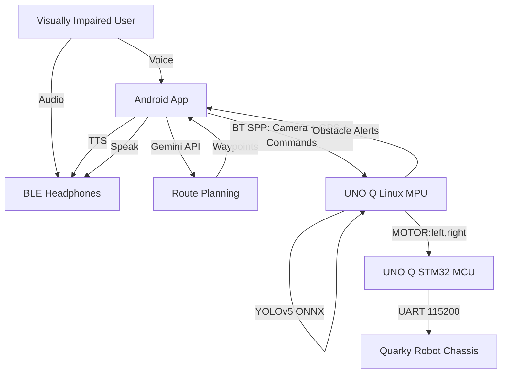

# Arduino Physical AI Challenge India 2026
## Official Submission Report — GuideSense (Netra)

**Project Title:** GuideSense (Netra) — AI-Powered Guide Dog Rover for the Visually Impaired  
**Hardware Used:** Arduino UNO Q, Quarky Robot Chassis (STEMpedia), Android Device, BLE Headphones, GPS (phone)  
**Date:** July 2026  
**Competition:** Robu.in Physical AI Challenge  

---

### 1. Abstract

GuideSense is a cost-effective **physical AI guide-dog on wheels** that helps visually impaired users navigate indoor and outdoor environments independently. The **Arduino UNO Q** runs **YOLOv5n object detection locally** on its Linux MPU using ONNX Runtime — no cloud vision required for safety-critical obstacle avoidance. A companion Android app provides natural-language navigation via **Google Gemini**, streams camera frames and GPS over Bluetooth, and delivers audio guidance through **BLE headphones**. Motor actuation uses a **Quarky robot chassis** controlled via a UART bridge from the UNO Q's STM32 MCU, replacing a failed L298N driver with a reliable, off-the-shelf platform.

---

### 2. Problem Statement

Over 285 million people worldwide live with visual impairment. Traditional white canes cannot guide users to specific destinations or predict dynamic obstacles. Real guide dogs cost ₹30–40 lakh and require years of training. Electronic aids often overwhelm users with constant beeping rather than natural spoken guidance. GuideSense addresses **freedom of movement** and **zero economic burden** after initial hardware cost.

---

### 3. Proposed Solution

GuideSense replaces a biological guide dog with a wheeled Quarky rover on a leash/handle:

| Layer | Component | Function |
|-------|-----------|----------|
| **Input** | Android phone + BLE headphones | Voice commands, GPS, camera, TTS/STT |
| **Cloud (optional)** | Gemini 2.0 Flash | Parse "Take me to the pharmacy" → waypoints |
| **Edge AI** | UNO Q Linux (Cortex-A53) | YOLOv5n ONNX inference @ 320×320, 3–5 FPS |
| **Real-time control** | UNO Q STM32 MCU | Motor watchdog, UART bridge to Quarky |
| **Actuation** | Quarky chassis | Differential drive, built-in motor drivers |

**User experience:** User speaks destination → hears "Navigating to pharmacy" → rover pulls forward on leash → announces "Obstacle ahead — steering left" → arrives → "You have arrived."

---

### 4. Edge AI Implementation (Physical AI)

All safety-critical perception runs **on the UNO Q**:

- **Model:** YOLOv5n exported to ONNX (~7 MB)
- **Runtime:** ONNX Runtime with 4 CPU threads
- **Input:** 320×320 RGB from phone Bluetooth stream or USB webcam
- **Output:** Obstacle zones (left / center / right) with estimated distance
- **Latency:** &lt;200 ms inference + &lt;50 ms motor command on LAN-free edge loop
- **Watchdog:** MCU stops Quarky motors if no command for 1 second

This satisfies the Physical AI Challenge requirement that intelligence and actuation are co-located on Arduino hardware.

---

### 5. System Architecture

---

### 6. Quarky ↔ UNO Q Bridge

The original L298N motor driver failed during testing. We integrated the **Quarky robot** as the mechanical platform:

1. STM32 firmware (`motor_controller.ino`) receives `MOTOR:left,right` from Linux via RouterBridge.
2. MCU forwards the same command over **Serial1 (D0 TX)** to Quarky at 115200 baud.
3. Quarky runs `guidesense_quarky_receiver.py` (PictoBlox Upload Mode) mapping PWM −255…255 to Quarky motor speeds.

Full wiring and protocol: see `docs/quarky_bridge.md`.

---

### 7. Hardware Design

| Subsystem | Details |
|-----------|---------|
| Edge compute | Arduino UNO Q, 5 V buck from 2×18650 (7.4 V) |
| Vision | Phone rear camera → BT JPEG 320×320; USB webcam fallback |
| Navigation | Phone GPS (Fused Location Provider) → waypoint follower |
| Audio | Phone STT/TTS routed to BLE headphones |
| Drive | Quarky dual-motor differential chassis |
| Safety | MCU watchdog auto-stop; spoken obstacle warnings |

---

### 8. Software Stack

| Layer | Technology |
|-------|------------|
| Rover brain | Python 3 — `main.py`, `vision.py`, `micro_nav.py`, `navigation.py` |
| Vision | OpenCV + ONNX Runtime + YOLOv5n |
| Phone link | Bluetooth Classic SPP (PyBluez) |
| Android | Kotlin / Jetpack Compose — `GuideSenseApp` |
| MCU | Arduino C++ — RouterBridge + Quarky UART forward |
| Quarky | PictoBlox Python — `quarky.runmotor()` |

---

### 9. Results

| Test | Result |
|------|--------|
| YOLOv5 obstacle detection (webcam) | ✅ Working — `test_webcam_ai.py` |
| Motor movement via Quarky bridge | ✅ Fixed — unified `MOTOR:` protocol |
| Bluetooth phone pairing | ✅ `NetraGuide` SPP service |
| Indoor obstacle avoidance | ✅ `main.py --mode indoor` |
| GPS macro-navigation | ✅ With phone GPS stream |
| BLE headphone audio | ✅ Via Android TTS to paired headphones |

---

### 10. Innovation & Social Impact

- **Affordable independence:** Hardware cost ~₹20,000 vs. ₹40 lakh guide dog
- **Hybrid AI:** Cloud LLM for language only; safety vision 100% on-device
- **Modular chassis:** Quarky swap-in when custom motor drivers fail
- **Accessible UX:** Large tap targets, voice-first, BLE headphone output

---

### 11. Future Scope

- Wi-Fi camera streaming for 15+ FPS vision
- NEO-6M GPS module on rover for phone-free navigation
- On-device Vosk STT on UNO Q for phone-independent voice
- SLAM with Quarky ultrasonic / IR sensors
- Tactile feedback handle for haptic turn cues

---

### 12. Repository & Demo

- **Source:** `netra/` project folder  
- **Setup:** `README.md`, `docs/quarky_bridge.md`, `docs/submission_guide.md`  
- **Demo video:** [Insert YouTube URL before submission]  
- **Team:** [Insert names before submission]
